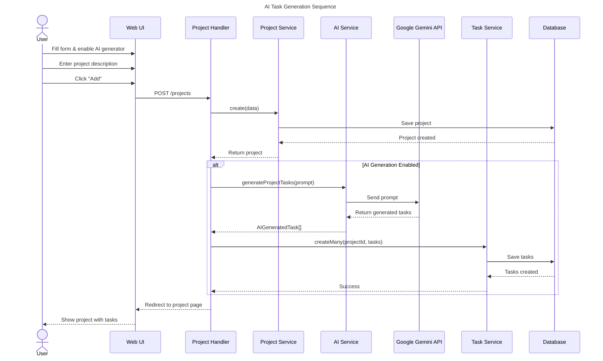

# AI Task Generation Flow

## Mermaid Live URL

https://mermaid.live/edit#pako:eNp1lMty2jAUhl9Fo0UnmSFgMFcvMkNCQr3IlAnJpqULIQmjxpZcWSalGd69R5bMtWED0vn06z8X9IGpYhxHuOC_Sy4pnwiSaJItJIKPESblaByjF1K8oSmXXBMjlERzTzuMUKM0ei24duucaCOoyIk06DVGpEAzrX5xatCj0tklM56dQF-JZOn_tDww39BjfM71RtRWTmRjT0ICn0JTngkpLDVVKoFs_QZ4uoRtGbxmVZFPVSd3lpkQQ5akgLgjbIVubm9f4wg9ijRFK6gG-oK4JEtX5sRVWOkL_kEarlHuU2a8oFrkthUX5H0q6Bta4DFjC-yinomBgLQiNPs2f0EtL1a4KAQgfKhwhKjmxPArBklcO-YQBXRyF6E52fDalEMmdzdnMnWbnBy7UKpNPXNTanmq5scrtb08Hr-HqmJe6-C-anhUV5H7S2yniivQzXJzfXQkdnm4fkMuXDLkqAPkgjcHbe-yvoIhY9XPVeucxvG0Bq2LHz8P4Ll3P1p12Z-I3F75WsSs4a45cu_x4z6cOXGd2MtWVThtwrFO7XheUsoLLwMVOe6DNeqH7JkzoW1XjdoPZU4Svp80y8FMguBave-Rd2HWzidu4EQLhiOjS97AGdcZsUv8YSUW2Kx5xhc4gp-Mr0iZGjvMOzgG_6_vSmX1Sa3KZI2jFUkLWJU5jGv9hu13NSTC9b0qpcHRoF1p4OgD_4HVsBn2eoOg3-2Hw6DXbeAtjrpBM-i1w95g2AnawWjU2TXw3-rOoDnshAOIhQF89QdtOAClgH_sk3tGq9e0gUlp1Hwrae3S-XqoyL2tVBGwZY2YbW4PJ6IwcJgquRKJ3S91CttrY_IiarVsuJlACctlk6qsVQi2hjdnvRn1W_1Of0g6Ie8PQtILQ0aX7dFw1em2V2wQtDsE73a7f5u44sk

